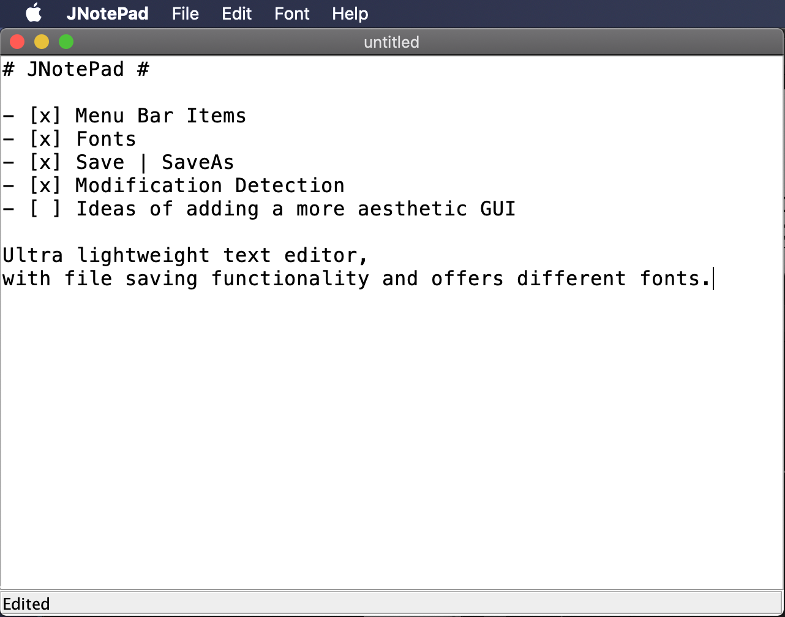

# JNotePad #



- [x] Menu Bar Items
- [x] Fonts
- [x] Save | SaveAs
- [x] Modification Detection
- [ ] Ideas of adding a more aesthetic GUI

Ultra lightweight text editor,  
with file saving functionality and offers different fonts.

### compile ###

to compile `.java` file into a `build/` directory containing `.class` files  
do:

```bash
$ javac JNotePad.java -d build/
```

to build a `.jar` file:
```bash
$ javac JNotePad.java -d build/
$ jar cvfe JNotePad.jar JNotePad -C build/ .
```

### usage ###

double click on `JNotePad.jar`  
*or* run through command line
```bash
$ java -jar JNotePad.jar
```

*or* run from `.class` files in `build/` directory
```bash
$ java -cp build/ JNotePad
```

## Menu Bar Items ##

### File ###
***Open*** | ***Save*** | ***Save As*** | ***Close***  
asks to *Save* when closing an edited file

### Edit ###
***Cut*** | ***Copy*** | ***Paste***  
the usual

### FONTS! ###
- *Helvetica*
- *Monospaced*
- *Times Roman*

### Help ###
***About***  
Author (me!) & description

## Authors ##

- **simon** - *~~buy my merch~~ hire me pls* - [mightbesimon](https://github.com/mightbesimon)

old project in 2015, retrospectively uploaded

## License ##

MIT

## Acknowledgments ##

- Ideas of adding a more aesthetic GUI
- old project back when I just started Java in 2015
- retrospectively uploaded to github